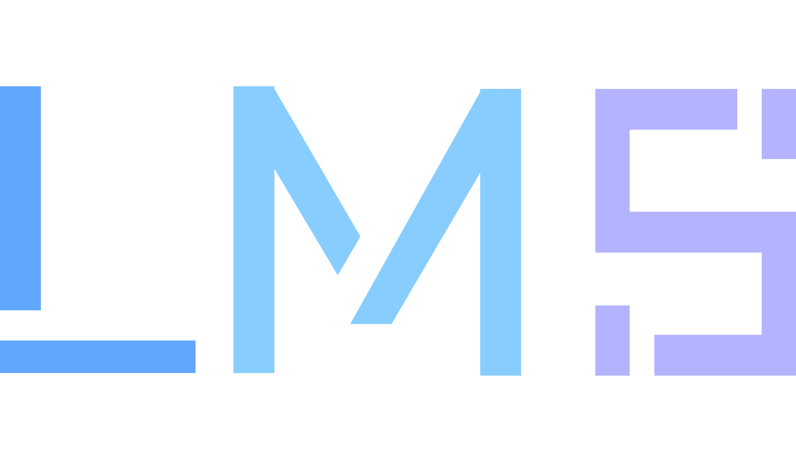
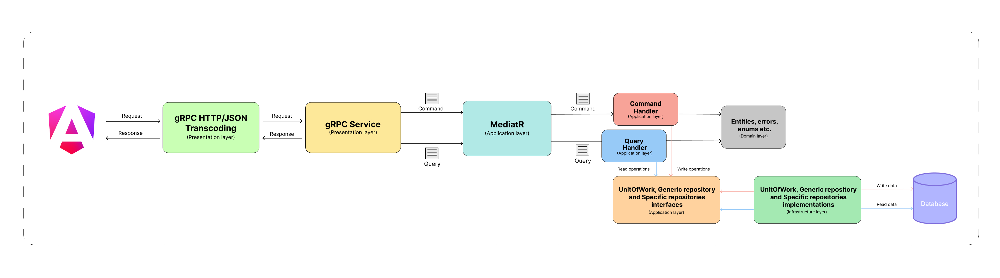
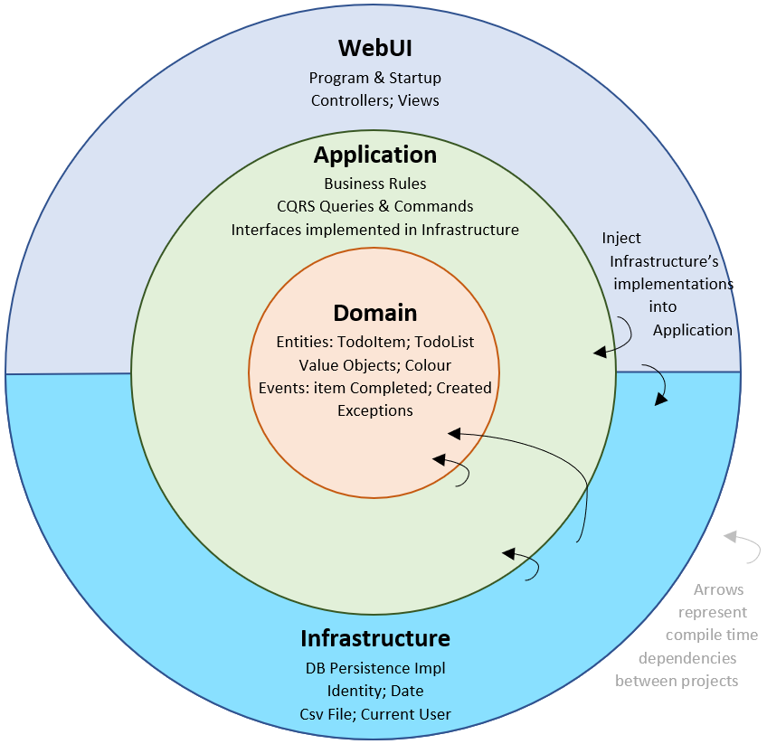
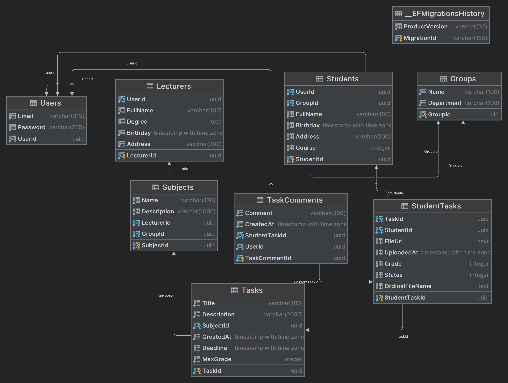

<div align="center">



[](https://GitHub.com/ilyam3004/graphs/contributors/)
[](https://github.com/ilyam3004/LMS/blob/main/LICENSE)
[](https://github.com/ilyam3004/LMS/stargazers)
[](https://github.com/ilyam3004/LMS/issues)
[](https://github.com/ilyam3004/LMS/pulls)
----

</div>

# Table of Contents
1. [Overview📖](#overview)
2. [Give a Star! ⭐](#give-a-star)
3. [Use cases / Features⚙️](#use-cases-/-features)
    - [Todo Lists Management](#todo-lists-management)
    - [Task Management](#task-management)
    - [Deadline and Priority Management](#deadline-and-priority-management)
    - [Today's Tasks](#todays-tasks)
4. [Technologies🛠️](#technologies)
5. [Architecture📐](#architecture)
6. [Other Patterns and Principles📚](#other-patterns-and-principles)
    - [Mediator](#mediator)
    - [CQRS](#cqrs)
    - [Unit of Work](#unit-of-work)
    - [Generic Repository](#generic-repository)
    - [Result](#result)
7. [Database Schema📊](#database-schema)
8. [Installation🏗️](#installation)
9. [Contributing🖐](#contributing)
10. [License🧾](#license)


# Overview📖
Simple task management solution designed using Angular 16 and ASP.NET 8. This application, following Clean Architecture principles, serves as more than just a task organizer—it can be utilized as a clean architecture template project, providing a solid foundation for scalable and maintainable applications.

# Give a Star!⭐
If you like this project please consider giving it a ⭐ Star ⭐ at the top right of this page. Thanks a lot!

# Use cases / Features⚙️
This application provides a comprehensive set of features for managing subjects, tasks, and student works. The system is designed to facilitate effective communication and collaboration between lecturers and students, enabling seamless task assignment, submission, feedback, and grading.

## Lecturer Features
1. **Manage Subjects**
   - Lecturers can create subjects for different student groups.
   - Lecturers can remove subjects as needed.

2. **Task Management**
   - Assign Tasks: Lecturers have the ability to assign tasks to specific subjects.
   - Download Student Works: Lecturers can view and download the works uploaded by students.
   - View Group Statistics: Lecturers can access statistics for the entire group related to tasks and uploads.

3. **Feedback and Grading**
   - Write Comments: Lecturers can provide feedback by writing comments on student task solutions.
   - Grade Solutions: Lecturers can assign grades to student task solutions.

4. **Subject Statistics**
   - Overview: Lecturers can view comprehensive statistics for all their subjects.
   - Task Uploads: Lecturers can see what tasks students have uploaded and which ones are pending.
   - Average and Total Grades: Lecturers can view the average and total grades for every student in a subject.

## Student Features
1. **Subject Information**
   - View Subjects: Students can access information about the subjects they are enrolled in.
   - Task Details: Students can see details about tasks assigned for each subject, including deadlines.

2. **Task Submission**
   - Upload Task Solution: Students can upload their solutions for assigned tasks.
   - Add Comments: Students have the option to write comments when submitting task solutions.
   - Resubmit Solution: If the wrong file was uploaded, students can remove and re-upload their solutions.

3. **Personal Statistics**
   - Task Details: Students can view detailed information for every task, including grades and comments.
   - Subject Summary: Students can see the total and average grades for each subject.

These features collectively create a comprehensive Learning Management System, facilitating effective communication and management between lecturers and students.

# Technologies🛠️
- [gRPC](https://grpc.io/) - for efficient and high-performance Remote Procedure Calls (RPCs), allowing seamless communication between a client and a server.
- [ASP.NET 8](https://dotnet.microsoft.com/en-us/apps/aspnet) - for building gRPC Services.
- [Angular 17](https://angular.io/) - for building the client-side application.
- [MediatR](https://github.com/jbogard/MediatR) - for implementing Mediator pattern.
- [Entity Framework Core](https://github.com/dotnet/efcore) - ORM
- [Mapster](https://github.com/MapsterMapper/Mapster) - for mapping between entities and DTOs.
- [FluentValidation](https://github.com/FluentValidation/FluentValidation) - for validating requests.
- [xUnit](https://github.com/xunit/xunit) - for unit testing.
- [Moq](https://github.com/moq/moq4) - for isolating dependencies in unit tests.

# Architecture📐

Our system operates on a client-server model, utilizing gRPC for efficient communication. To enhance compatibility, we've incorporated JSON transcoding, allowing seamless data exchange in JSON format between the client and server. This simplifies integration and ensures a smooth interaction. Explore the diagram below to visualize the key components and their interactions within the system:

<div align="center">

</div>

AS you can see on the backend of our application follows Clean Architecture principles, which allows for a highly decoupled, testable, and maintainable codebase. The architecture of the system is divided into four layers: Domain, Application, Infrastructure, and Presentation:

<div align="center">

</div>

## Domain
The Domain layer encompasses all entities, enums, exceptions, errors and logic that are specific to the business domain of the system.

## Application
The Application layer contains all application logic. It depends on the Domain layer, but is independent of any other layer or project. This layer contains command and query handlers, defines interfaces that other layers can implement. For instance, if the application requires access to a user repository, a new interface is added to the Application layer and an implementation is created within the Infrastructure layer.

## Infrastructure
The infrastructure layer refers to the layer that handles low-level tasks such as network communication, database access, and file system operations. It serves as a bridge between the application layer and the underlying infrastructure, providing a clean separation of concerns. This includes managing connections to databases, caching data and handling security. One of the main benefits of using an infrastructure layer is that it allows for greater flexibility and scalability in the API. By separating the application logic from the underlying infrastructure, changes to one layer can be made without affecting the other. This makes it easier to modify, test, and deploy the API as needed.

## Presentation
Finally, the Presentation layer is an ASP.NET Web API which gives us an opportunity to build SPA applications, Mobile apps or Desktop clients and so far. This layer is responsible for all user interface logic and depends on the Application layer.

# Other patterns and principles📚
As you may have noticed in the preceding diagram, there are several other patterns used in building this architecture. Let's explore these concepts to grasp how they contribute to building modular, testable, and maintainable software.

## Mediator
Mediator provides a simple and elegant way to implement communication between different components of a system without directly coupling them together. In this pattern, each component sends messages to a mediator, which then distributes those messages to other components that have registered to handle them. This approach allows for a decoupled and loosely coupled architecture, where components do not need to know about each other's existence, promoting scalability and maintainability. Overall, MediatR promotes the Single Responsibility Principle (SRP) and enhances the modularity and testability of the system.

## CQRS
CQRS (Command Query Responsibility Segregation) design pattern separates the operations that modify state from those that read state in a system. This separation allows for different optimizations and scaling strategies for the two types of operations. In a CQRS architecture, commands represent actions that change the state of the system, while queries represent requests for information about the system's current state. By separating these concerns, a CQRS system can be optimized for both high write throughput and fast query performance. However, implementing a CQRS architecture can be complex and may require significant changes to existing systems.

### Unit of Work
The Unit of Work pattern ensures the proper management of transactions and maintains data consistency throughout an application. It helps orchestrate multiple operations within a single transaction, either committing all changes or rolling back if an error occurs. The Unit of Work pattern is crucial for maintaining data integrity and ensuring atomicity in data operations.

### Generic Repository
The Generic Repository pattern provides a standardized interface for data access operations. It allows for generic implementations of common data access methods, promoting code reusability and consistency in data interactions. The Generic Repository pattern simplifies the data access layer by providing a uniform API for various entities within the application.

### Result
The Result pattern enhances error handling and response generation in an application. It provides a structured way to handle success and failure scenarios, allowing for better communication of outcomes between components. The Result pattern contributes to the overall robustness of the system by promoting clear and consistent handling of results.
These patterns collectively contribute to a well-architected system, promoting modularity, testability, and maintainability in software development.

# Database Schema📊
Check out the schema diagram below to see how tables are organized and connected.



# Installation🏗️
This section provides step-by-step instructions for launching **LMS** using Docker Compose for managing containers.

1. Clone the Repository:
```bash
   git clone https://github.com/ilyam3004/LMS.git
   cd LMS
```

2. Set the connection string for your PostgreSQL Database in [docker-compose.yml](https://github.com/ilyam3004/LMS/blob/bc509976ced65aaaa56be717c02cd592322700fd/docker-compose.yml#L12) file. The database schema will be configured automatically when you run the application:
```yml
   environment:
      - ConnectionStrings__DefaultConnection={{YOUR_CONNECTION_STRING}}
```

3. Then run docker-desktop and build docker images:
```bash
docker-compose build
```

4. Run docker containers:
```bash
docker-compose up
```

5. Access the application at http://localhost:4200/

6. To stop the application and remove containers run this:
```bash
   docker-compose down
```

# Contributing🖐
To start contributing, follow these steps:

1. **Fork the Repository**: Click the "Fork" button on the top right corner of this repository to create your copy.

2. **Clone the Repository**: Clone the repository to your local machine using `git clone`.

```bash
git clone https://github.com/ilyam3004/LMS.git
cd LMS
```

3. **Create a New Branch**: Before making any changes, create a new branch for your work.

```bash
git checkout -b feature/your-feature-name
```

4. **Make Changes**: Implement your changes or additions to the codebase or documentation.

5. **Commit and Push**: Commit your changes and push them to your forked repository.

```bash
git add .
git commit -m "Brief description of your changes"
git push origin feature/your-feature-name
```
6. **Submit a Pull Request**: Go to the original repository and click on "New Pull Request." Provide a clear description of your changes and submit the pull request.

# License🧾
This project is licensed under the MIT License - see the [LICENSE](LICENSE) file for details.